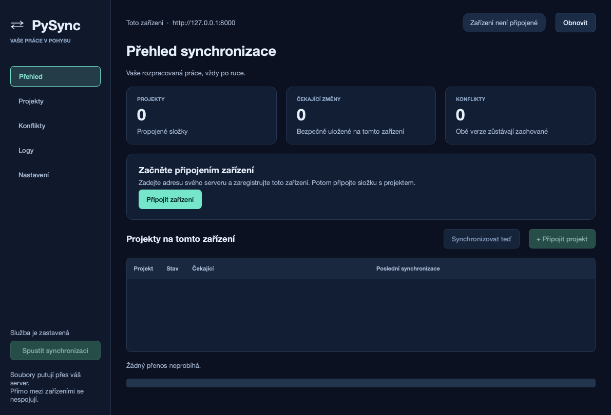
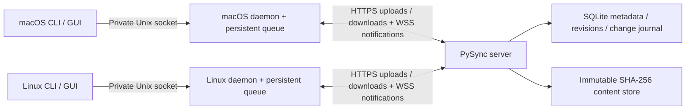

# PySync

[](https://github.com/karelpelcak/PySync/actions/workflows/ci.yml)


**Keep your unfinished work in sync between macOS and Linux through your own server.**

PySync is a self-hosted file synchronization application for developers who switch between computers. Save a file on your laptop and it appears on your desktop without committing or pushing to Git. A Raspberry Pi or Linux computer stores committed file versions and coordinates every transfer; devices never need direct peer-to-peer connectivity.

The project includes a server, a background client daemon, a command-line interface and an optional native desktop GUI. It is an initial implementation for one owner and trusted devices on a private network. Conflict merging is manual, and synchronization does not replace backups.

[Installation guide](INSTALLATION.md) · [Desktop guide](pysync-client-gui/README.md) · [Deployment](docs/deployment.md) · [Protocol](docs/architecture.md) · [Troubleshooting](docs/operations.md)

## What works

- Continuous file creation, modification, deletion and rename synchronization, including nested directories, Unicode names and spaces.
- A persistent offline queue, automatic reconnect, replay of missed server changes and safe operation retries.
- Server-assigned revisions and optimistic concurrency. Concurrent edits preserve the accepted version and a recognizable conflict copy; client clocks never select a winner.
- Streamed full-file transfers, SHA-256 verification, complete-file publication, crash recovery and retained recovery copies.
- Default ignores for `.git`, `.venv`, `node_modules`, caches and `.env` files, plus global and project-specific patterns.
- Device-token authentication, membership checks, safe project-relative paths and HTTPS/WSS support.
- A desktop dashboard for projects, transfer progress, pending changes, conflicts, logs and registration. Its labels are currently in Czech.
- Detached daemon execution and templates for automatic startup through macOS launchd or Linux systemd user services.

## Try the local two-client demo

You need Git and [uv](https://docs.astral.sh/uv/getting-started/installation/). The repository pins Python 3.12; uv can install it for you.

```sh
git clone https://github.com/karelpelcak/PySync.git
cd PySync
uv python install 3.12
uv sync --locked
uv run python scripts/local_demo.py
```

The demo starts a real server and **two independent client daemon processes**. It prints two project directories, named `macbook` and `linux`. Create or edit a test file in either directory, then inspect the other: the contents propagate through the server. Use `--port 8010` if port 8000 is occupied.

Press Ctrl-C to stop the demo. **Its temporary workspace is deleted when it stops; use disposable test files only.** The persistent setup below keeps server data across restarts.

## Persistent local setup

Start the backend from the repository root:

```sh
uv sync --locked
mkdir -p .pysync-data
chmod 700 .pysync-data
# Run once to create the owner credential; reuse it on later starts.
(umask 077; uv run python -c 'import secrets; from pathlib import Path; p = Path(".pysync-data/owner-token"); p.open("x").write(secrets.token_urlsafe(32) + "\n")')
export PYSYNC_SERVER_OWNER_TOKEN="$(cat .pysync-data/owner-token)"
uv run pysync-server
```

The server listens on `http://127.0.0.1:8000` and persists data in `.pysync-data`. On subsequent starts, only export the existing token and run the server. Stop the foreground process with Ctrl-C. The token and server data are excluded from Git.

### Desktop client

In another terminal at the repository root:

```sh
uv sync --locked --extra gui
uv run --extra gui pysync-client-gui
```



Choose **Připojit zařízení** and enter the server URL, a device name and the contents of `.pysync-data/owner-token`. The owner token authorizes first-time registration. Afterward, the client uses its own device token; the GUI does not retain the owner token.

Choose **Spustit synchronizaci**, then **Připojit projekt**. Select an existing local directory, choose a server project or new project name, and review **Zkontrolovat změny** before accepting. Check **Nahrát také existující lokální soubory** only if you intend to upload the initial local contents. An empty directory is the simplest way to join an existing project.

The GUI and CLI share the same daemon and configuration. Closing the window leaves synchronization running. **Pozastavit synchronizaci** stops the daemon. Include `--extra gui` in root `uv` commands when you want Qt to remain installed, or run the GUI from its own package directory.

### Command-line client

```sh
uv run pysync-client-cli init --server-url http://127.0.0.1:8000
uv run pysync-client-cli login --device-name macbook
# Paste the owner token at the hidden prompt.
uv run pysync-client-cli daemon start
uv run pysync-client-cli project add '/absolute/path/to/my-project' --name my-project --accept-local
uv run pysync-client-cli status
```

The directory must exist. Attachment displays a plan before asking for confirmation. `--accept-local` permits initial uploads; differing contents become preserved conflicts. Without it, initial local-only files stay local and differing local contents are retained in `.pysync-recovery` before downloading the server version.

On another computer, register a different device, create an empty directory and join the same server project:

```sh
uv run pysync-client-cli init --server-url https://raspberrypi.YOUR-TAILNET.ts.net
uv run pysync-client-cli login --device-name linux
uv run pysync-client-cli daemon start
mkdir -p '/absolute/path/to/my-project'
uv run pysync-client-cli project add '/absolute/path/to/my-project' --server-project my-project
```

Both computers must use the same reachable server URL. Loopback is only for clients on the server's computer; use private HTTPS for actual remote devices. See [installation](INSTALLATION.md) for complete macOS/Linux setup, Raspberry Pi provisioning, HTTPS and automatic startup.

## Everyday commands

| Command | Purpose |
| --- | --- |
| `pysync-client-cli status` | Connectivity, projects, pending operations, last sync and errors |
| `pysync-client-cli project list` | Attached local projects |
| `pysync-client-cli project status NAME` | One project's status |
| `pysync-client-cli sync [NAME]` | Request reconciliation through the existing daemon |
| `pysync-client-cli project add PATH --server-project NAME` | Review and attach another local root |
| `pysync-client-cli project remove NAME` | Detach without deleting local files; pending work blocks removal |
| `pysync-client-cli conflicts` | List unresolved conflicts and preserved copies |
| `pysync-client-cli conflicts --resolve UUID` | Mark a manually merged conflict resolved; copies remain |
| `pysync-client-cli logs --lines 100` | Recent structured daemon logs |
| `pysync-client-cli daemon start / stop / status` | Manage detached synchronization |
| `pysync-client-cli daemon run` | Foreground debugging or service-manager execution |

Prefix commands with `uv run` from the workspace root, or `uv run --extra gui` when keeping the desktop installed. `uv run pysync-client-cli --help` describes all options. Use `--config-dir PATH` **before** the command for an independent client identity and state.

## Architecture



| Package / directory | Responsibility |
| --- | --- |
| `pysync-server` | FastAPI, Uvicorn, authenticated WebSockets, async SQLAlchemy metadata, migrations and immutable file storage |
| `pysync-client-cli` | Typer/Rich CLI, singleton daemon, watchdog, periodic reconciliation, httpx transfers and persistent SQLite state |
| `pysync-client-gui` | Optional PySide6 desktop, reviewed onboarding and background workers calling daemon IPC |
| `pysync-shared` | Validated Pydantic protocol schemas, portable path rules, POSIX filesystem safety and JSON logging |
| `tests` | Unit, local-network integration and two-client daemon/GUI end-to-end tests |
| `scripts` | Disposable demo and launchd/systemd service-file generation |
| `docs` | Deployment, configuration examples, operational behavior and verification |

The four packages form one uv workspace with a committed root `uv.lock`. Keep the workspace together. Each executable package also supports `uv sync` and its own `uv run` entry point from its directory. Server-only installations do not require Qt.

Every outgoing edit names its base file revision and a durable operation UUID. The server commits a monotonically increasing project revision, records the journal and returns the same response on retry. Tombstones prevent stale offline copies from resurrecting deletions. WebSocket notifications wake the client; journal recovery remains the source of truth if notifications are missed. Read the [protocol and recovery guide](docs/architecture.md) for commit ordering and filesystem guarantees.

## Security and data safety

Run PySync for trusted devices on a private LAN/VPN, preferably with HTTPS through Tailscale Serve. Device bearer tokens are required for file access and WebSocket sessions. The owner token can register/revoke devices and archive projects; each device stores a separate credential in a private configuration file.

Uploads are bounded, streamed and checksummed. Project-relative paths reject traversal, unsafe collisions and symlink escapes. An inaccessible or replaced root pauses deletion inference. Conflict/recovery copies are retained, and the GUI refuses to discard queued work. Credentials, databases, logs and runtime directories are ignored by Git.

Never expose token-bearing HTTP or unencrypted WebSockets to the public internet. Back up server metadata and blobs together, plus client queues and `.pysync-recovery` directories. See [deployment](docs/deployment.md) and [operations](docs/operations.md).

## Development and verification

```sh
uv sync --locked --extra gui
uv run --extra gui ruff check .
uv run --extra gui ruff format --check .
uv run --extra gui pytest -q
```

The suite uses temporary directories and loopback networking; it does not require a Raspberry Pi. Desktop tests run Qt offscreen. The latest local verification passed **56 tests on macOS with Python 3.12.15**, including two independent daemons and GUI-driven synchronization. GitHub Actions runs the same suite on Ubuntu and macOS; the badge reports its current result. Without Qt, nine desktop tests skip. See [executed verification](docs/verification.md) for exact checks and platform coverage.

## Current limitations

- Full-file transfers only: no deltas, resumable chunks, compression or automatic conflict merging.
- Periodic scans hash complete files; very large trees need good ignore rules and a suitable polling interval. No large-scale benchmark is provided.
- History, tombstones, operation records and recovery copies do not have automatic garbage collection; logs do not rotate automatically.
- Renames use revision-checked delete/create operations. Empty directories, symlinks and special files are not synchronized.
- One owner and trusted devices; no multi-tenant ACL administration, keychain integration or public-service rate limiting.
- No packaged desktop installer, tray icon or merge editor. Automatic login startup requires the documented service-manager setup.
- POSIX mechanisms target macOS/Linux; Windows is unsupported. Raspberry Pi deployment templates need verification on your hardware.

These limits and recovery procedures are described in [operations](docs/operations.md). Report problems through [GitHub Issues](https://github.com/karelpelcak/PySync/issues), including sanitized logs, platform, Python version and reproduction steps. Do not include credentials or private synchronized content.
